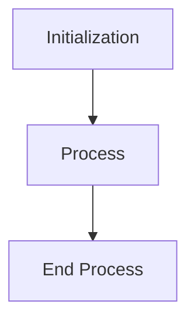
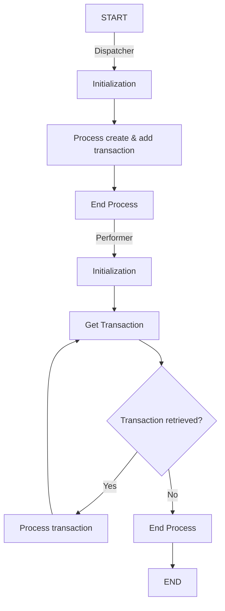

There are 2 types of UiPath project templates provided in this repository. Both are based on the Robotic Enterprise Framework, also known as REFramework, template of UiPath modified based on the type of process -- Non-transactional and Transactional.

# Non-transactional Process
Process expected to execute only once. The REFramework was used to utilize its error handling and retry mechanism, and was mainly modified to remove the Get Transaction Data state since there is no transaction to process.
## Flow
*This diagram does not include error handling flow*

# Transactional Process
Process expected to process multiple transactions. This template type contains 3 main workflows:
1.	Controller (Main.xaml) - Runs the dispatcher then the performer
2.	Dispatcher (Dispatcher_Main.xaml) - Creates the transactions and stores to queue. The dispatcher uses the non-transactional template structure.
3.	Performer (Performer_Main.xaml) - Processes the transactions in the queue. The performer uses the original REFramework structure.

## Flow
This diagram does not include error handling flow

# All Modifications
List of all modifications done on REFramework to achieve these templates
## Both non-transactional and transactional
- Follow naming convention
    - Activity display name: *Activity Name*: *description*
    - Variable name: camelCase
    - Workflow name: PascalCase

- Change config file from Excel to JSON
    - Not application dependent
    - Can run RPA even if config file is opened

- Load config file based on environment flag (DEV/TEST/PROD)
    - Main configuration file should follow filename format: Config_{environment}.json
    - Environment flag can be set from "in_EnvironmentFlag" In Argument of Main.xaml
- Removed log messages from config

- TakeScreenshot
    - Moved from Framework to Common folder
    - Add screen selector in_argument to have option to screenshot specific UI

- Work folder
    - Added automatic create/delete of work folder where temporary files used in the process can be stored. This folder is deleted after processing the current transaction

- Backup folder
    - Added automatic create/delete of backup folder which gets deleted when number of days set in config file passes

- End Process other clean up process
    - Modify End Process state to add try catch for other clean up process

- GetTransactionData
    - Set transaction reference as transaction ID

- Deleted unnecessary files and arguments (e.g. out_TransactionField1, io_dt_TransactionData, etc.)

- Consecutive system exception retry number log and exception message
    - Main.xaml > Initialization state > Changed counter in exception message to remove +1
    - SetTransactionStatus > System Exception > Moved consecutive system exception log to after increment

## Non-transactional only
- Remove get transaction data process
    - Deleted "Get Transaction Data" state and GetTransactionData.xaml
    - Deleted transaction-related variables and arguments
    - Initialization state Successful transition goes to Process state
    - Process state Success transition goes to End Process
    - Process state Business Exception transition goes to End Process
    - Deleted RetryCurrentTransaction.xaml: Retry mechanism will be handled through ConsecutiveSystemException
    - Renamed SetTransactionStatus.xaml to SetProcessStatus.xaml

## Transactional only
- Implement dispatcher and performer model
    - Use original REFramework as performer, and non-transactional template as dispatcher